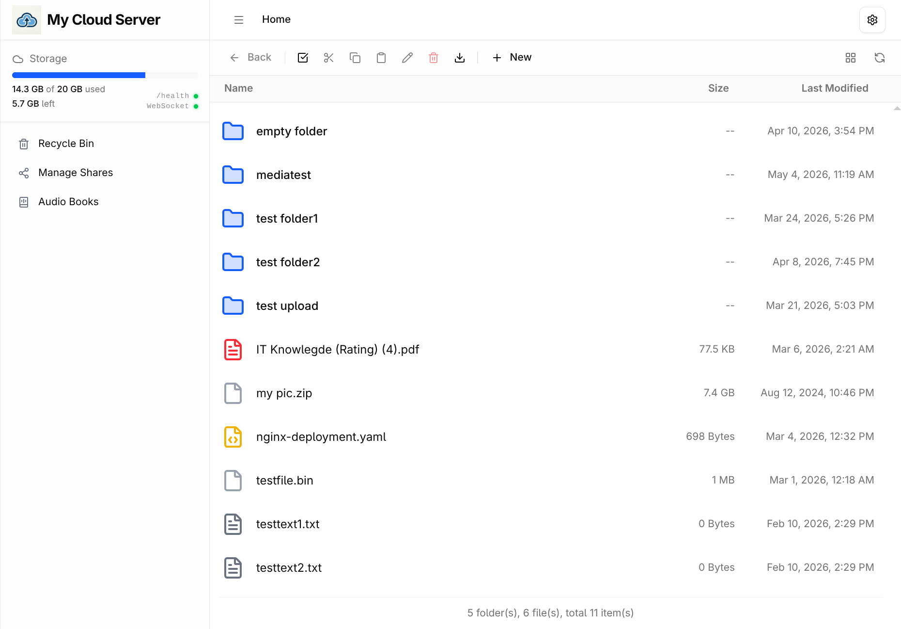
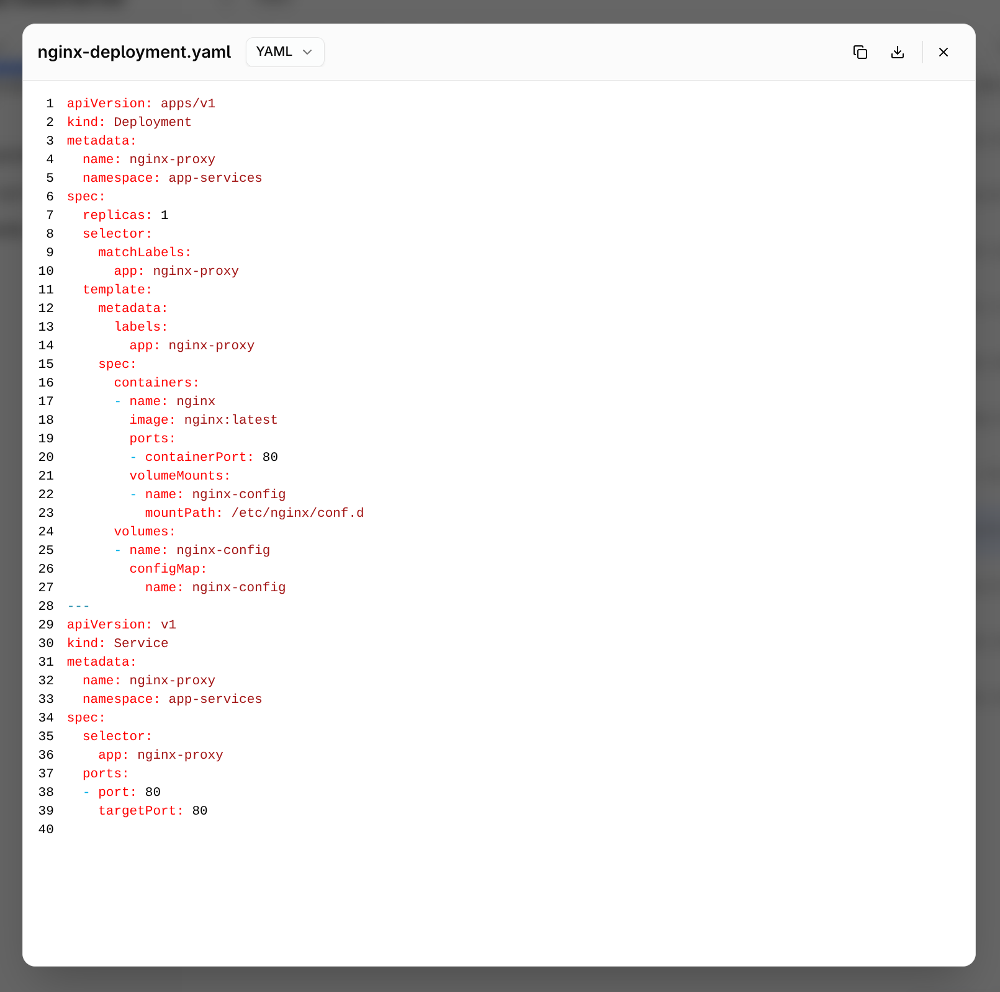
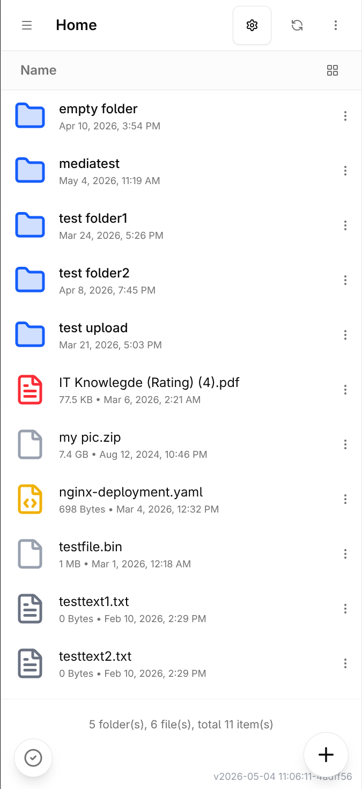
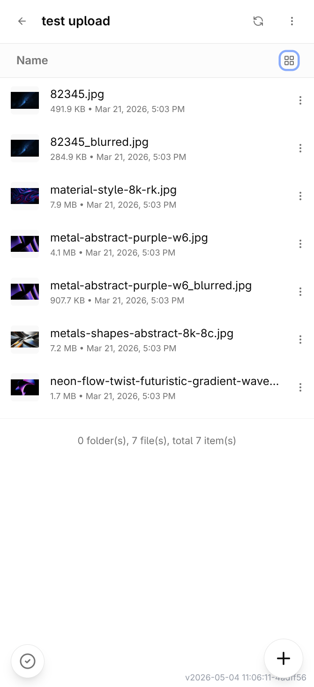
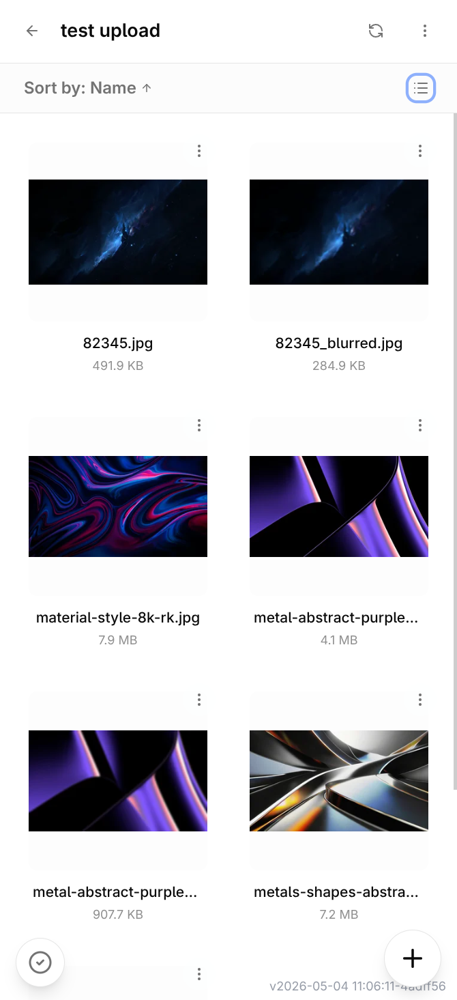
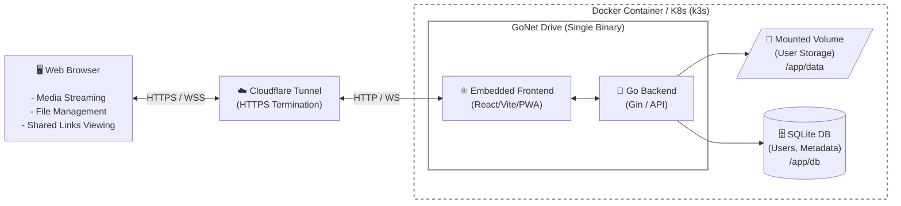

## Features In-Depth

- 🎵 **Music Player**: Listen to your music right in the browser.
- 📄 **Document Viewing**: View PDF files and plain text documents directly in the web UI without downloading them first.
- 🔐 **Security & Access**:
  - Every critical endpoint is protected by secured JWTs using HTTP-only cookies.
  - Multi-Factor Authentication (eg.Google Authenticator) support.
  - API rate-limiting to prevent brute-force attacks.
- 📱 **Modern UI**: Dark/Light mode, responsive design that works beautifully on desktop and mobile devices.
- 🌐 **Progressive Web App (PWA)**: Install GoNet Drive to your device for a native app-like experience. Tested and fully supported on Windows, macOS, Linux, Android, iOS, and Chromium browsers.
- 🚀 **Easy Deployment**: A multi-stage Dockerfile builds a single binary output with frontend fully embedded.

## Screenshots

| Desktop View - Home Page | Text Viewer with Syntax Highlight |
|:---:|:---:|
|  |  |

| Mobile View | File List (List View) | File List (Grid View) |
|:---:|:---:|:---:|
|  |  |  |

## Architecture



## Tech Stack

- **Backend**: Go 1.24+, Gin Framework, SQLite (for metadata & users), Gorilla WebSockets.
- **Frontend**: React 18+, TypeScript, Vite, Tailwind CSS, shadcn/ui.

## Installation & Running

### Using Docker (Recommended)

*Note: There is currently no pre-built Docker image repository available. You will need to clone this repository and build the image manually.*

The easiest way to get started is by using Docker. The provided `Dockerfile` will build both the frontend and backend, and run the final lightweight Alpine image.

```bash
# Clone the repository
git clone https://github.com/leonkhoo123/gonet-drive.git
cd gonet-drive

# Build the Docker image
docker build -t gonet-drive .

# Run the container
# This exposes the web UI on port 8080.
# Make sure to mount volumes for both your files (bind mount) and the database (docker volume) to persist them.
# ⚠️ For maximum security in production, set APP_ENV to "prod" and properly configure ALLOWED_ORIGINS.
# ⚠️ If you need to access the UI from a non-HTTPS URL (e.g. local network), remove APP_ENV and ALLOWED_ORIGINS environment variables to prevent blocking.
docker run -d \
  --name gonet-drive \
  -p 8080:8080 \
  -e APP_ENV="prod" \
  -e ALLOWED_ORIGINS="https://your-domain.com" \
  -e APP_JWTSECRET="<your_jwt_secret_key>" \
  -e ADMIN_USER="<admin_username>" \
  -e ADMIN_PASS="<admin_secure_password>" \
  -v /path/to/your/folder-you-wanted-to-serve:/app/data \
  -v gonet_db:/app/db \
  gonet-drive
```

## Environment Variables

The server can be configured using environment variables. You can set them directly in your environment or use a `.env` file in the directory where the binary is executed.

- `WORK_DIR`: The root directory for the files to serve and manage. *(Default: `/app/data`)*
- `DB_DIR`: The directory where the SQLite metadata database is stored. *(Default: `/app/db` in Docker, empty otherwise)*
- `LISTEN_ADDR`: The host and port for the server to listen on. *(Default: `:8080`)*
- `APP_JWTSECRET`: The secret key used to sign JWT auth tokens. **(Required)**
- `APP_JWT`: Set to `OFF` to disable JWT authentication middleware (enabled by default).
- `ADMIN_USER`: The username for the initial superadmin account. 
- `ADMIN_PASS`: The password for the initial superadmin account.
- `APP_ENV`: Application environment. Set to `prod` for maximum security in production. *(Default: `local`)*
- `ALLOWED_ORIGINS`: Comma-separated list of allowed CORS origins. *(Default: `*`)*
- `VIDEO_HOSTNAME`: Optional public URL override to serve video streams.
- `DEFAULT_SERVICE_NAME`: The name of your cloud server displayed in the UI. *(Default: `My Cloud Server`)*
- `DEFAULT_UPLOAD_CHUNK_SIZE`: Default chunk size for file uploads in MB. *(Default: `5`)*
- `DEFAULT_STORAGE_LIMIT`: Default storage limit for new users in MB. *(Default: `20480`)*

**Authentication & Cookie Settings (Advanced):**
- `TOKEN_NAME`: Name for the authentication token. *(Default: `file_server_token`)*
- `COOKIE_ACCESS_TOKEN`: Name of the access token cookie. *(Default: `access_token`)*
- `COOKIE_REFRESH_TOKEN`: Name of the refresh token cookie. *(Default: `refresh_token`)*
- `COOKIE_MFA_PENDING`: Name of the MFA pending cookie. *(Default: `mfa_pending`)*
- `COOKIE_SHARE_JWT`: Name of the shared link JWT cookie. *(Default: `shareJwt`)*
- `ACCESS_TOKEN_MAX_AGE`: Access token expiration duration. *(Default: `15m`)*
- `REFRESH_TOKEN_MAX_AGE`: Refresh token expiration duration. *(Default: `168h`)*
- `MFA_PENDING_MAX_AGE`: MFA pending status expiration duration. *(Default: `5m`)*
- `SHARE_JWT_MAX_AGE`: Share link JWT expiration duration. *(Default: `168h`)*

## Project Structure

- `cmd/main.go`: The main entrypoint for the Go application.
- `internal/`: Contains the Go backend logic (controllers, services, repositories, database models, etc.).
- `database/migrations/`: SQL migration files for the SQLite database.
- `frontend/`: The React + Vite frontend source code.
- `ui/`: Holds the embedded frontend `dist/` folder after compilation, injected into the Go binary.

## License

This project is licensed under the MIT License. See the `LICENSE` file for details.
